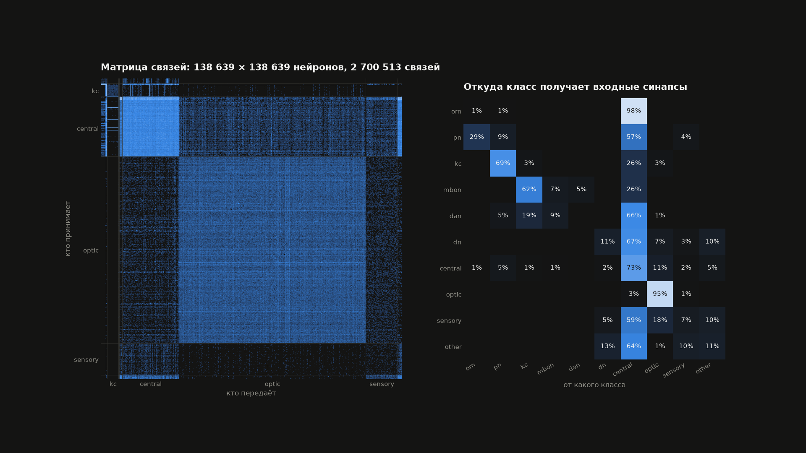

# 🪰 Обучение дрозофилы решать тесты

[English](README.en.md) · **Русский**

**Настоящий коннектом дрозофилы учат решать тесты по машинному обучению**

     

     


  

Коннектом дрозофилы FlyWire v783 (138 639 нейронов, 2,7 млн связей >= 5 синапсов) превращён
в рекуррентную сеть, и эту сеть учат решать тесты schmidtml. Проводка настоящая и не меняется:
обучаются два числа на нейрон и линейное считывание — 278 578 параметров. 3D-визуализация
показывает, как по мозгу мухи проходит «запах» вопроса и ответа.



## Результаты

Одна и та же муха, одни и те же 278 578 обучаемых чисел — меняется только чувство, которым подан текст.


| задача                                       | обоняние, 54 канала | зрение, 10 855 каналов | случайно |
| -------------------------------------------- | ------------------- | ---------------------- | -------- |
| Уровень 1 — тесты сайта (746 вопросов)       | 45,6%               | **60,8%**              | 30,5%    |
| Уровень 2 — вопросы собеседований (537)      | 49,9%               | **83,2%**              | 25,0%    |
| Сортировка вопросов по этапам роадмапа (758) | 37,2%               | **53,1%**              | 14,3%    |


Точность на экзамене — вопросах, которых муха не видела; среднее за последние 5 эпох, один seed.

## Запуск

```bash
uv sync
mkdir -p data && cd data
curl -LO https://github.com/philshiu/Drosophila_brain_model/raw/main/Connectivity_783.parquet
curl -LO https://github.com/philshiu/Drosophila_brain_model/raw/main/Completeness_783.csv
curl -L -o annotations.tsv https://raw.githubusercontent.com/flyconnectome/flywire_annotations/main/supplemental_files/Supplemental_file1_neuron_annotations.tsv
cd ..

uv run fly-train --task quiz                                  # уровень 1: тесты сайта (~40 с/эпоха на M4 Pro)
uv run fly-train --task interview --init runs/quiz/brain.pt   # уровень 2, муха продолжает учиться
uv run fly-train --task quiz --seed 1                         # повтор с другим seed —> runs/quiz-s1
uv run fly-train --task quiz --senses sight                   # текст «глазами»: 10 855 каналов вместо 54
uv run fly-train --task topics --epochs 15                    # эксперимент «Сортировка по темам»
uv run fly-train --task level.json                            # свой набор вопросов (формат ниже)
uv run fly-continual                                          # эксперимент «Роадмап и забывание»
uv run fly-continual --replay 0.3                             # то же, с повторением 30% прошлых карточек
uv run fly-plot-matrix                                        # матрица связей —> docs/connectome-matrix.png
uv run mlflow ui --backend-store-uri sqlite:///mlflow.db --port 5050   # http://127.0.0.1:5050 (5000 на macOS занят AirPlay)
```

Вопросы проприетарные и в репозиторий не входят: уровень — это файл `levels/<имя>.json` со списком задач
в формате ниже, собирается отдельно. Эмбеддинги текста считаются один раз на версию данных и кешируются
в `cache/`. Каждый запуск — run в эксперименте MLflow `schmidtml-fly` (параметры, метрики, трейсы
этапов, артефакты), а обученная модель регистрируется в Model Registry как `fly-<уровень>` и
загружается через `mlflow.pytorch.load_model("models:/fly-quiz/1")`. Локальная копия —
`runs/<уровень>[-s<seed>]/`: `brain.pt` и `history.json`.

Формат своего набора: `[{"q": "...", "options": ["...", "...", "...", "..."], "answer": [0]}]`.

## Структура

```
src/fly/
├── model/brain.py          коннектом —> FlyBrain: чувства, динамика, считывание с нисходящих нейронов
├── data/tasks.py           загрузка уровней из JSON, эмбеддинги e5 с кешем, разбиение на учёбу и экзамен
├── training/
│   ├── train.py            обучение с учителем (fly-train)
│   ├── continual.py        этапы роадмапа по очереди и метрика забывания (fly-continual)
│   ├── metrics.py          точность, лосс, статистика мозга по классам нейронов
│   └── baselines.py        ориентиры «без мухи», включая потолок входа
├── viz/
│   ├── export.py           запись активности для 3D-сцен (fly-export-viz)
│   └── matrix.py           матрица связей картинкой (fly-plot-matrix)
├── utils/                  загрузка конфигов, пути проекта, трекинг MLflow
└── configs/                все числа и названия, которые не код:
    ├── model.json          динамика мозга (шаги, усиление), чувства, классы нейронов
    ├── data.json           энкодер, пути, этапы роадмапа, доля экзамена
    ├── training.json       MLflow, значения аргументов команд по умолчанию, ориентиры «без мухи»
    └── viz.json            палитра, подписи, параметры картинки матрицы связей
tests/                      pytest на игрушечном мозге из 300 нейронов
docs/                       картинки для README
viz/                        three.js: облако нейронов и муха за столом
```


## Разработка

```bash
uv run pytest               # тесты и примеры из докстрингов, ~7 с; ни коннектом, ни вопросы не нужны
uv run ruff check .         # линтер; он же стоит хуком на pre-commit
uv run ty check             # типы
uv run pre-commit install   # один раз после клонирования
```

Покрытие держится на 100% принудительно (`fail_under = 100` в `pyproject.toml`): упало покрытие — упали тесты.
Из подсчёта исключены только функции `main()`: это часы обучения на настоящем коннектоме с MLflow.

## Визуализация

```bash
uv run fly-export-viz --run runs/quiz --n 4   # ~18 МБ на вопрос, вопросы из экзамена
cd viz && python3 -m http.server 8000
# http://localhost:8000/?run=quiz            — облако из 138 639 нейронов, активность по шагам
# http://localhost:8000/desk.html?run=quiz   — муха за столом решает тест, над ней голограмма мозга
```

Две страницы на одних и тех же данных:

- `index.html` — мозг мухи крупным планом: 138 тыс. нейронов, варианты ответа и их «притяжение»;
- `desk.html` — низкополигональная муха сидит за столом в ночной неоновой комнате и решает тест
на мониторе, над ней голограмма мозга, внизу панель NEURAL REPLAY. Усики, крылья, голова и выбор
двигаются по записанной активности.

Общие параметры URL: `run` — какой запуск, `q` — с какого вопроса, `speed` — шагов симуляции в
секунду (по умолчанию 6), `clean` — без интерфейса (для записи экрана). Только у `desk.html`:
`pixel` — крупность пикселей (по умолчанию 2, `1` — без пикселизации), `shot` — стартовый план
камеры (0–3), `noholo` — без голограммы.

Клавиши: пробел — пауза, <——> — вопрос, H — интерфейс; в `desk.html` ещё C — следующий план камеры,
B — голограмма. `--split train` в экспорте берёт вопросы, на которых муха училась.

## Источники данных

- Zheng et al., *A complete electron microscopy volume of the brain of adult Drosophila melanogaster*, Cell 2018.
- Dorkenwald et al., *Neuronal wiring diagram of an adult brain*, Nature 2024.
- Schlegel et al., *Whole-brain annotation and multi-connectome cell typing of Drosophila*, Nature 2024.
- Eckstein et al., *Neurotransmitter classification from electron microscopy images at synaptic sites in Drosophila melanogaster*, Cell 2024.
- Shiu et al., *A Drosophila computational brain model reveals sensorimotor processing*, Nature 2024.
- Lappalainen et al., *Connectome-constrained networks predict neural activity across the fly visual system*, Nature 2024.
- Caron et al., *Random convergence of olfactory inputs in the Drosophila mushroom body*, Nature 2013.
- Aso et al., *The neuronal architecture of the mushroom body provides a logic for associative learning*, eLife 2014.
- Dasgupta, Stevens, Navlakha, *A neural algorithm for a fundamental computing problem*, Science 2017.
- Liu & Wilson, *Glutamate is an inhibitory neurotransmitter in the Drosophila olfactory system*, PNAS 2013.
- Tully & Quinn, *Classical conditioning and retention in normal and mutant Drosophila melanogaster*, J Comp Physiol A 1985.
- Wang et al., *Multilingual E5 Text Embeddings: A Technical Report*, 2024.

